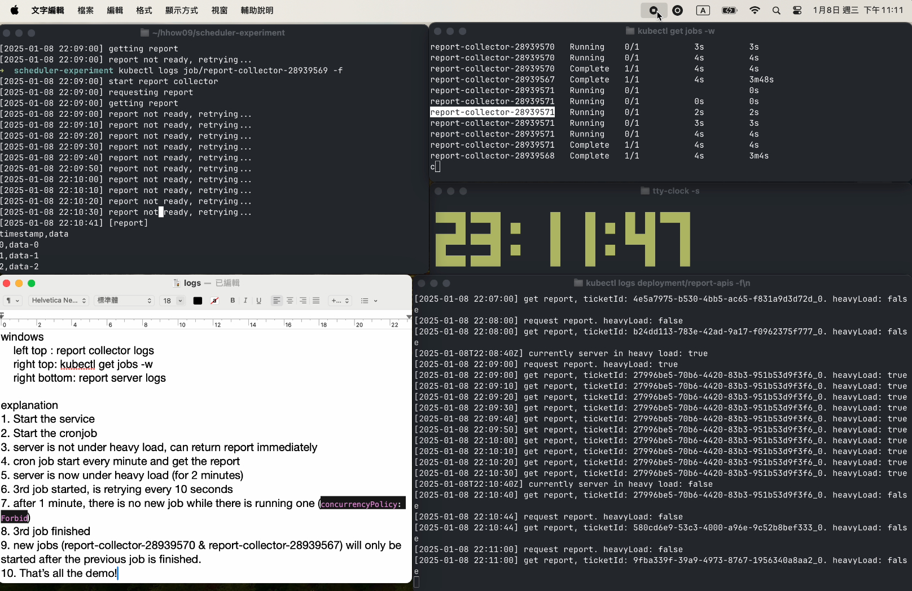
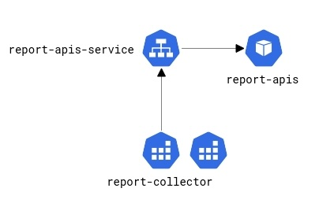

# Scheduler Experiment
## Background
- We have a [report server](#report-apis) that can generate report and return the report csv file.
- We want to collect the report periodically (every 1 minute) with [report collector](#report-collector).
- Consider the situation: **the report server is sometimes under heavy load and cannot return the report csv file within 1 minute.** If we start new report request before the previous one finishes, **it can cause the report server to overload and get even slower.**

## Purpose of this experiment
- Demonstrate Kubernetes `CronJob` to run Job periodically
- Using [Concurrency policy](https://kubernetes.io/docs/concepts/workloads/controllers/cron-jobs/#concurrency-policy) **to control the jobs when job is running longer than expected.**

## Demo Video
[](https://youtu.be/Y-tVzdw0Y30)

## Components

### Report APIs
- [source code](./services/report-apis)
- it is a simple report query server with following APIs:
  - `/request_report`: accept requesting report and return a ticket id
  - `/get_report/{ticketId}`: return the report csv if it is ready, otherwise return "report is not ready"
- there is a **periodic heavy load** on the server, when it is on, the `/get_report/{ticketId}` will only return `"report is not ready"`.
    - It is toggled every 2 minutes

### Report Collector
- [source code](./services/report-collector)
- it is a simple report collector do following things:
  1. send report request to `/request_report`
  2. use ticketId to get report from `/get_report/{ticketId}`
    - if `report is not ready`, retry every 10 seconds
    - if succeeds, print the report and exit

---

## Setup
1. install [kubectl](https://kubernetes.io/docs/tasks/tools/)
2. install [minikube](https://minikube.sigs.k8s.io/docs/)
3. `minikube start` (ref: https://minikube.sigs.k8s.io/docs/start/)
4. set `alias kubectl="minikube kubectl --"`

### Build Images and push to minikube
```bash
eval $(minikube docker-env)  # https://minikube.sigs.k8s.io/docs/handbook/pushing/
make build_images
```

## Demo Commands
```bash
make start_all
# check the report api log
kubectl logs deployment/report-apis 
# check job list
kubectl get jobs
# check job log (replace the job id with actual one)
kubectl logs job/report-collector-1610168820
```

## Alternative: file lock
- When using other services such as [GCP Cloud Run](https://cloud.google.com/run/docs/execute/jobs-on-schedule), the concurrency control might not be available. 
- In this situation, using **file lock** could be a vialble solution: 
    - When the report collector start a job, it will create a lock file in cloud storage and delete it when the job is finished.
    - if the lock file exists, it should wait until the lock is released.
- drawback: the new job is already running while waiting for the lock.
